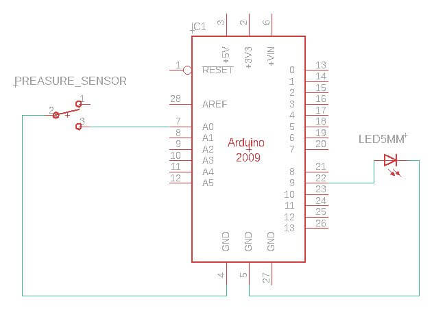
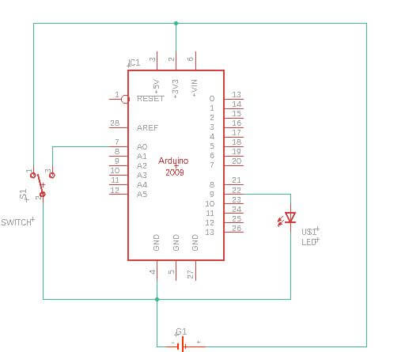

# 5. E-textiles

This week I did some research on different threads and conductive textiles; options that can possibly be apply to the future of wearables.

## Research
Following is some found research and note taking regarding the most important parts form my own understanding of the subject matter.

I landed on an article- [On "how to work with conductive fabric"](https://www.instructables.com/How-to-Work-With-Conductive-Fabric/) and further depth on the possible applications that this could entitle. It really helped me conceptualize the possibilities, as the concept themselves can become very abstract and the applications hard to grasp.

* Instructible guide to working with conductive fabric, all this new tech can be overwhelming.
* Big  Intresting references inside:
		* (Im Blanky)Vimeo  - dense surface equiped with soft sensors .  Tilt Sensors that use traditional embroidery techniques. when
		* Massage me jacket: a Jacket that make  a backrub massadge a game, turning lights on to indicate the "massagable" area of the back
		* Fabric Drape Sensing controller: uses fabric ability to strech and create tension as tactile msuical interface.
* Lilipad arduino, arduino for the textile industry play arround.

Strech:
* When conductive fabric is attached to knits, materials that need expanding and contracting.
* Knitted thin straight rubbonsd and can be softly bent arround curves,
* Change in current when a fabric is streached
Woven
* Examples: screen mesh, twills, taffeta ext.
* More weight choises,
* Stable in conductivity and electrical properties
* Low resistance, good for power and data

Nonwoven
* Fabric from fiber bonded with chemical, mechanica heat, or solvent treatment, laminated with protective coating
* Low resistance, found in non woven coductive fabric
* High resistance, thker squishier make great force sensing resistors
* Breathable in cases
* Bonding can add strength,
* Dificult to find in small quantities
* Stiff, and dificult to work with

###	Ohms per square
* Conductive fabrics have fibers and conductive metals. The particular resistance depends on variation of the content of metals and fibers. This metric calculates the sheet resitance of the material.
* "If a fabric is labeled as 2 Ω per ▢ it means that when the material is cut in a square, no matter how large or small that square is, it should be 2 Ohms. If cut in another dimension, such as a rectangle, the Ohms per inch are multiplied by the aspect ratio. For example:
* If we define a 1" square an one unit and cut a rectangle that is 1" x 3", the aspect ratio if that rectangle is 3.
	2 Ω (per ▢) x 3 (aspect ratio) = 6 Ohms"
* "Remember that it's uninsulated, so you if you are pumping a good amount of power through an exposed circuit, it can be dangerous"
### Defining the purpose of the conductive fabric
* For traces, look for low resistance
* For contactwitches, look for low resistance
* Capacitive touchswithces look for fairly high resitance, the change in voltage is all that is detected
* Resitors, replace with properly dimentioned material
* Piezoresistive mateirals, change charge when force is applied, as bending or streching  

Conductive Glue/Paint  
"A variety of conductive glues and paints can be bought, such as "wire glue" that contains a silver or carbon compound. You can also make your own by following Instructables and other online tutorials showing you how, usually by using graphite. These mediums open the door to creativity, you can paint, stencil and screen print with some. For connections though, they can be unreliable depending on what they are made of."

###	Data or Power?
It's difficult to find voltage and current ratings for conductive fabrics. Be careful pumping anything more than a few hundred milliamps and 5 volts through. This makes fabric better for data lines rather than running power through.


## Example Guide Projects
Some good examples I contemplate on using as guides are the following  
[Three Fabric Buttons](https://www.instructables.com/Three-Fabric-Buttons/)  
[Neoprene Bend Sensor IMPROVED](https://www.instructables.com/Neoprene-Bend-Sensor-IMPROVED/)  
[Conductive Thread Pressure Sensor](https://www.instructables.com/Conductive-Thread-Pressure-Sensor/)  
[Stroke Sensor](https://www.kobakant.at/DIY/?p=792)  
[Zebra Fabric Stroke Sensors](https://www.kobakant.at/DIY/?p=6163)
[Simple Fabric Pressure Sensors](https://www.kobakant.at/DIY/?p=232)  
Inspiration:   
[Touch and electronic textile](https://medium.com/@ricardoonascimento/touch-and-electronic-textiles-371d30fcc239) /
[Kristi Kuust](http://www.kristikuusk.com/) /
[JACQUARD](https://atap.google.com/jacquard/technology/) /

Learning outcomes
  * Understand how we can produce soft circuits, sensors and actuators
  * Learn how to embed them in garments, soft objects or wearables
  * Study and learn soft-hard connections
  * Discover necessary materials, components, tools
  * Explore and replicate existing projects

##Assignment
* [ ] Build at least one digital and one analogue soft sensors, using different materials and techniques.
* [ ] Document the sensor project as well as the readings got using the AnalogRead of Arduino
* [ ] Integrate the two soft sensors into one or two textile swatches using hard soft connections
* [ ] Document the circuit and it’s schematic
* [ ] Document your swatches
* [ ] Upload a small video of the swatches functioning
* [ ] EXTRA POINT Integrate the swatch into a project

##Digital Sensor
  Bill of materials  
    - 1 1.5 x 1.5 cm Velostat  
    - 2 1.3 x 1.3 cm Conductive copper Fabric  
    - 1 3x1.5cm Neoprene  (for the cover)
    - 2 Stitch points of conductive thread  


###Testing Switch  
<iframe src="https://player.vimeo.com/video/477324476" width="640" height="564" frameborder="0" allow="autoplay; fullscreen" allowfullscreen></iframe>

L1 = led, P1 = Velostat Switch  
In this case I ended using the pin 13 instead of Vcc, when pushed the velostat reduces its resistance and turn on the light.  

###Analog Read  

The following is a reading of the sensor with the arduino.
The velostat was used in the same format.  



The following is the code used, taken from LizaStark in her tutorial.
   ```
		int sensorPin = A0;    // select the input pin for the sensor
		int ledPin = 9;     // select the pin for the LED
		int sensorValue = 0;  // variable to store the value coming from the sensor


		void setup() {
		// declare the ledPin as an OUTPUT:
		pinMode(ledPin, OUTPUT);  
		pinMode(sensorPin, INPUT);
		Serial.begin(9600);
		}

		void loop() {

		// read the value from the sensor:
		sensorValue = analogRead(sensorPin);

		analogWrite(ledPin, sensorValue);

		//Print the value to the Serial monitor   
		Serial.println(sensorValue);  

		}
	   ```
		 
The following was the result:


##Analog Soft Sensor
Bill of materials  
  - 1 1.5 x 1.5 cm 1.5mm EVA   
  - 1 .6 x 2cm cm Conductive copper Fabric  
  - 1 6x2.5cm Neoprene  (for the cover)
  - 2 Stitch points of conductive thread  


AnalogRead  

<iframe src="https://player.vimeo.com/video/477325249" width="640" height="564" frameborder="0" allow="autoplay; fullscreen" allowfullscreen></iframe>

<iframe src="https://player.vimeo.com/video/477325759" width="640" height="564" frameborder="0" allow="autoplay; fullscreen" allowfullscreen></iframe>

##Application  
###Concept  

<iframe src="https://player.vimeo.com/video/476701688" width="640" height="360" frameborder="0" allow="autoplay; fullscreen" allowfullscreen></iframe>

This assignment I have decided to apply e-textiles into my buff garment. I like to run, and when I run at night I use a Buff and a headlamp. The lamp comes handy when running at night, as signaling device for cars in the road and when I go into a trail.    

    
The head lamp is an injection plastic hard shell, It also tends to slip. A soft headlamp can be lighter, comfortable and  inconspicuous. There might be drawbacks when it requires washing in the future but for exploration purposes I find it to be a good idea.    

The buff is some sort of Lycra fabric, very stretchy, is used in the head or neck in various configurations. It protects the cold among other things.     

###Construction    

  

Bill of Materials    
	 x1 Buff  
	 x2 copper sheet (1.5 x 3 cm)  
	 x1 Velostat sheet (1 x 2 cm)  
	 x1 Double sided Tape (hold it all until the sawing)  
	 x6 wires (Solder to the copper sheets & other components)  
	 x1 Arduino Micro produce  
   x1 battery  
	 x1 LED  

The sensor was a digital pressure sensor, it has the flexibility that its not noticeable when attached to the buff.    
The casing of the sensor was attached in the ends of the sensor vertical to how the person would wear the buff as to not be unstitched.     

<iframe src="https://player.vimeo.com/video/477300731" width="640" height="360" frameborder="0" allow="autoplay; fullscreen" allowfullscreen></iframe>

The following is the components I decided to saw against the buff in order to make it work.

  

The code I used is below. A special thanks to [donwinchell](https://forum.arduino.cc/index.php?topic=200933.msg2086921#msg2086921) as I ended using a code he posted from a message board in arduino help section. Later modifying it to my needs, and building on the electronic tutorials we did with Liza Stark.

		int switch1 = A0; // connect a push button switch between this pin and ground
		int ledpin = 9; // internal led, external LED, relay, trigger for other function, some other device, whatever.
		boolean flag = true;

		void setup()
		{
		pinMode(ledpin,OUTPUT); // this pin controlled by flipflop() function
		pinMode (switch1,INPUT_PULLUP); // keeps pin HIGH via internal pullup resistor unless brought LOW with switch
		Serial.begin(9600); // just for debugging, not needed.
		}

		void loop()
		{
		if (digitalRead(switch1)==LOW){ // check the state of switch1 every time we run through the main loop
		delay(5); // I don't REALLY know why this delay helps, but it does.
			flipflop(); // hops out of main loop and runs the flipflop function
		}// end of check for button press.

		// other sketch code here

		} // end of main loop.

		void flipflop(){  //funtion flipflop
		flag = !flag;  // since we are here, the switch was pressed So FLIP the boolian "flag" state (we don't even care if switch was released yet)
		Serial.print("flag =   " );   Serial.println(flag);   // not needed, but may help to see what's happening.

		if (flag == LOW){  // Use the value of the flag var to change the state of the pin
		digitalWrite(ledpin,HIGH ); // if the flag var is HIGH turn the pin on
		}
		if (flag == HIGH) {
		digitalWrite(ledpin,LOW); // if the flag var is LOW turn the pin off
		}
		while(digitalRead(switch1)==HIGH); // for "slow" button release, keeps us in the function until button is UN-pressed
		// If you take out this "while" the function becomes a flipflop oscillator if the button is held down.
		delay(50); // OPTIONAL - play with this value.  It is probably short enough to not cause problems. deals with very quick switch press.
		}
<a href="../files/week5/CodeLightBuff-donwinchell/CodeLightBuff-donwinchell.ino" download>Click to Download Code</a>    

##Integrate two soft sensors into one or two swatches with hard or soft connections  
After properly reading the assignment I realized I require a second sensor. I´m considering either:  
 	1. Adding an LED for light sensing, and adjusting the light to the environment  
	2. Using a conductive thread as a capacitive sensor to look for the human wearing it before the light is on.  
##Swatch Documentation
