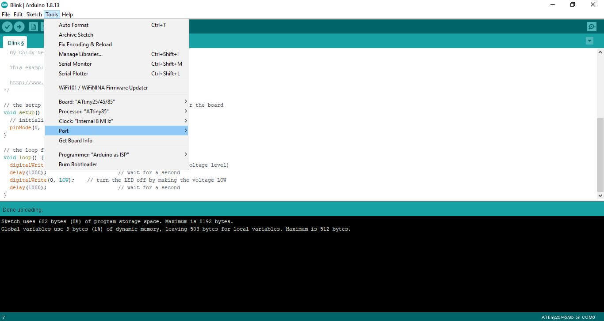
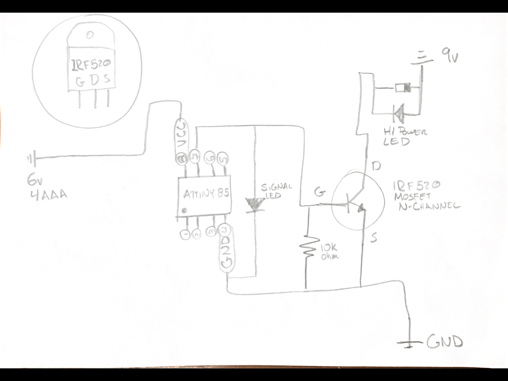

# 10. Wearables

November 23rd, 2020

Liza Stark

This second class on the topic of wearables and e-textiles will provide a more advanced coverage on soft sensors and actuators and programming interactions

## Research


## Useful links


[mosfet and transistor dronwbotworkshop] (https://www.youtube.com/watch?v=IG5vw6P9iY4)

(Capítulo 45 - MOSFET IRF520N módulo transistor de potencia (y PWM)) [https://www.youtube.com/watch?v=SliUieh2eVc]
## Tutorial Activities
1. Program Attiny 85
In order to prorgam the Attiny 85, I first required a couple of things:
  *  [Attiny85](https://www.microchip.com/wwwproducts/en/ATtiny85)
  * Arduino Uno
  * 1o uf Capacitor
  * led
  * 220 ohm Resistance


1.1 Setup
  In this case I followed the [Tutorial on programming attiny](https://www.instructables.com/Program-an-ATtiny-with-Arduino/) Recomended, as well as look over the tutorial on the fabclass.

I also found the following article usefull as a general purpose article to better undersatnd what is going on.  [Arduino as ISP and Arduino Bootloaders] (https://www.arduino.cc/en/Tutorial/BuiltInExamples/ArduinoISP).

1.2 Upload the code
  In this instance I uploaded the blink code to test out.
  * The library of the attiny85 was installed

  * The parameters to fit the specifically attiny 85 as follows:


  * The programming itself is as follows. The standard Blink example with the led pin changed to '0'.
   ``` python
   // the setup function runs once when you press reset or power the board
   void setup() {
     // initialize digital pin LED_BUILTIN as an output.
     pinMode(0, OUTPUT);
   }

   // the loop function runs over and over again forever
   void loop() {
     digitalWrite(0, HIGH);   // turn the LED on (HIGH is the voltage level)
     delay(1000);                       // wait for a second
     digitalWrite(0, LOW);    // turn the LED off by making the voltage LOW
     delay(1000);                       // wait for a second
   }
   ```
   * Referencial Diagram of Pinout of the Attiny 85:
  

  The end result, for simplicity I decided to use a cr2032 in the breadboard.

  <iframe src="https://player.vimeo.com/video/501037891" width="640" height="1138" frameborder="0" allow="autoplay; fullscreen; picture-in-picture" allowfullscreen></iframe>
  <p><a href="https://vimeo.com/501037891">TA-w10-1</a> from <a href="https://vimeo.com/mrjsnap">mr.jsnap</a> on <a href="https://vimeo.com">Vimeo</a>.</p>

2. Undestanding Mosfets
  * We saw this part in the tutorial of the week, so I wont go into too much detail. In this case I used the irf520 Mosfet. It is an N-channel Mosfet. Further information is found the [IRF520 Datasheet](http://www.irf.com/product-info/datasheets/data/irf520.pdf)
  
  * In this case I decided to use:  
    * High Intensity LED
    * 9 v battery for The high intensity LED
    * 4 AAA Batteries to Power the Attiny, Connected in parallel to create a total volt of 6v, Attiny works up to 5.5v
    * 10k ohm resistor
    * Diode for High Intensity LED
    * Attiny 85, with basic "blink code"
  * The connection was follows:

The code used is:

``` python

// the setup function runs once when you press reset or power the board
void setup() {
  // initialize digital pin LED_BUILTIN as an output.
  pinMode(2, OUTPUT);
}

// the loop function runs over and over again forever
void loop() {
  analogWrite(2, 255);   // turn the LED on (255 is the voltage level)
  delay(1000);                       // wait for a second
  analogWrite(2, 0);    // turn the LED off by making the voltage 0
  delay(1000);                       // wait for a second
}

```
The final result is as follows:  

<iframe src="https://player.vimeo.com/video/501335415" width="640" height="1138" frameborder="0" allow="autoplay; fullscreen; picture-in-picture" allowfullscreen></iframe>
<p><a href="https://vimeo.com/501335415">ta-w10-21</a> from <a href="https://vimeo.com/mrjsnap">mr.jsnap</a> on <a href="https://vimeo.com">Vimeo</a>.</p>

The final goal was to make the entire circuit independent so it works on portable power alone. With this we can test it with the swatches.


3. Swatch: One input and one Output.
The following is a setup, using a similar setup as before.
The great difference is I am using the previously done soft sensor and a pull up input.
* the led will change from off to midway on, to full On.
* The input pullup pin is pin 1


```
int sw_pin = 1;
int conutner_reset = 3; //how many times we press before we reset

int led_pin = 0; // pin of the led

//variables will change:
int coutner = 0;
int sw_status = 0;
int last_sw_status = 1;


void setup() {
  // initialize input and output pin:
  pinMode(sw_pin, INPUT_PULLUP);
  pinMode(led_pin, OUTPUT);

}

void loop() {
  // put your main code here, to run repeatedly:
  sw_status = digitalRead(sw_pin);

  //compare the switch to its previous state
  if(sw_status != last_sw_status){

    if(sw_status == HIGH){
      coutner = coutner + 1 ;
    }
      delay(10);
  }


  last_sw_status = sw_status;

  if (coutner == conutner_reset){
    coutner = 0; // set the counter to zero again
  }

  if(coutner == 0){
    analogWrite(led_pin, 0); //led is off
  } else if(coutner == 1){
    analogWrite(led_pin, 50);//led is on half way
    delay(100);
  } else if(coutner == 2){.
    analogWrite(led_pin, 255); //led is full on
    }

  }
  ```
  <iframe src="https://player.vimeo.com/video/501938018" width="640" height="1138" frameborder="0" allow="autoplay; fullscreen; picture-in-picture" allowfullscreen></iframe>
  <p><a href="https://vimeo.com/501938018">ta-w10-3</a> from <a href="https://vimeo.com/mrjsnap">mr.jsnap</a> on <a href="https://vimeo.com">Vimeo</a>.</p>

 4. Generate Sound
  - Generate Sound with Arduino
In this case, we used:
  IRF520 Mosfet
  9v battery
  3w Speaker
  Arduino
  Along with the tutorial reviewed in class.

  ```
  /*ema pareschi 2020
 * I generate a sound on a speaker, frequency of 100hx
 * */

const int speaker = 3; //buzzer to arduino pin 8


void setup() {

  pinMode(speaker, OUTPUT); // Set buzzer - pin 8 as an Output

}

void loop() {

  tone(speaker, 1000); //send 1khx dounf signal
  delay(1000);
  noTone(speaker);
  delay(1000);

}
  ```
  The final Result was as follows:
      <iframe src="https://player.vimeo.com/video/515395149" width="640" height="564" frameborder="0" allow="autoplay; fullscreen" allowfullscreen></iframe>

  - Play Music of Device on Speaker
The same excersice was done as with the arduino, with the modification of using a 1.8mm White Swade leather. The conductive thread was sawn with machine on top, and the speaker used 3 20mm round Rare earth magnets, two under the speaker and one to hold the other two in place. as follows:

<iframe src="https://player.vimeo.com/video/515423075" width="640" height="564" frameborder="0" allow="autoplay; fullscreen" allowfullscreen></iframe>
What became interesting is by folding the swade on itself it actually becomes the tension in order to create sound.
