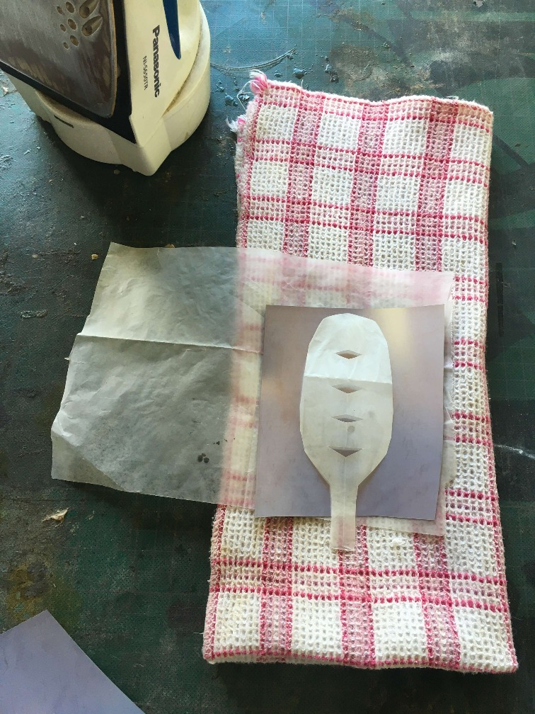
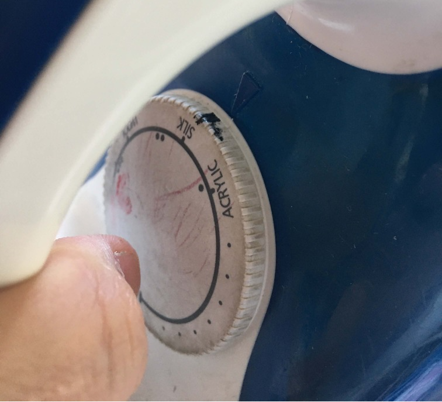
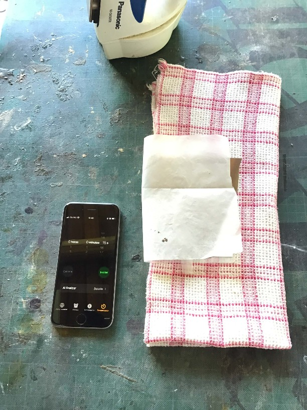
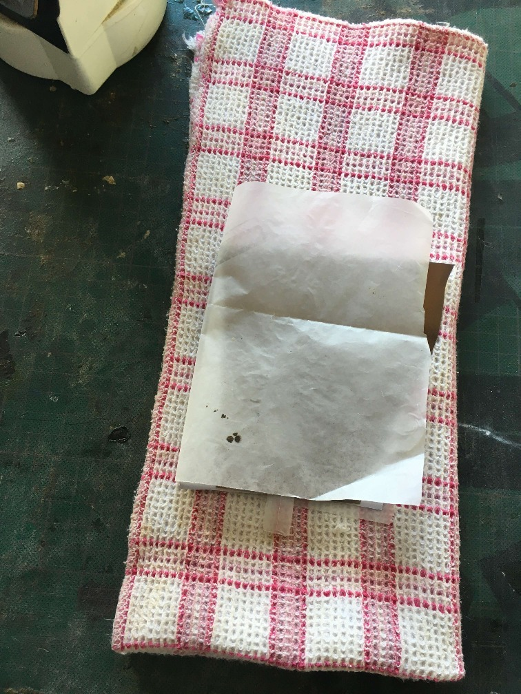
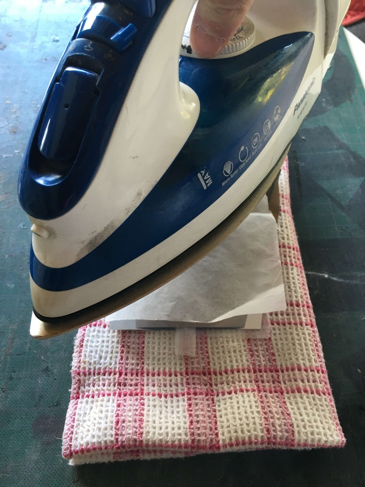

# 12. Soft Robotics

## Research
I found myself very inspired by the Pnebotics. Their work is really exiting, and blew my mind when they actual y started picking up things with the pneumatic robots.  

<iframe width="560" height="315" src="https://www.youtube.com/embed/Ku-TavNuwwc" frameborder="0" allow="accelerometer; clipboard-write; encrypted-media; gyroscope; picture-in-picture" allowfullscreen></iframe>

  

- [Fun examples](https://www.otherlab.com/blog-posts/m3-robots)   

I also remembered this architect, Its also a proof of concept that the technology can be applied in a consumer space.
- [Oskar Zieta](https://www.architonic.com/en/story/nora-schmidt-blow-up-sheet-metal/7000205)  
Long ago made a chair out of inflated metal. It seems the patterns was what gave it the shape, and not the air obstructions but it is non the less inspiring.

## Useful links

- [Soft Robotics](https://adrianacabrera.github.io/SoftRobotics/index.html)

## Inflatable Textile Vinyl

### Materials
In order to work with this process, we acquired Textile Vinyl, commonly understood as stamping vinyl for t-shirts.  

- The Brand is Chemical US  

- The material specifically is Polyurethane Metallic 461 Super zinc, we tried with other materials with less success.  There was also this cool perforated material, but it became counterproductive.

.JPG)

Recommendations for use: 293 F, 15s . Be careful as the material is thin.  
The wax paper in my case was also sort of sticking, so I used double Wax Paper, wax side out.
#### Impatient Attempt

.JPG)  
The first trial, I left the material too in the iron and I later was not able to pull out.
.JPG)
###My process  
####0.)Where to iron  
  
I place a cutting board to iron over, to protect my surface. Avoid direct heat (it will wrinkle it)    
Use a thick cotton based cloth. This will apply pressure to the vynil from the other side. It became important to put some weight to the ironing, it helps with joining the center wax cutouts of the vynil.  

####1.)Define the temperature for the iron.  
Us Chemiclas recommends 150 degrees (material provider) and its a great start.   
Doing trail and error with small swatches of the material until its aparent of proper union between the vynil sides.    
  
Mark the temperature that is working in the iron, so you can get back to it.  
In my case, I found the proper temperature was not 150, but 175 degrees. I think there is heat lose due to layering between the material wax paper and the vynil itself.     
####2.) Define the time
More trial and error. Make a setup where you have a timer next and use it every time you decide to join a patter.  
  
The provider's datasheet recommends 10s. I found out with the 175 temperature, 15s was a reliable time, so I had the timer set up to it.
####3.) The iron action  
Wrap the patter with wax paper.  
  
Make sure the iron is hot, start the timer.  
   
Apply as much pressure as you can, and respect the timer.   

#### Proof of Process
.JPG)  

<iframe src="https://player.vimeo.com/video/520075402" width="640" height="480" frameborder="0" webkitallowfullscreen mozallowfullscreen allowfullscreen></iframe>

#### Fist Motion Pattern
.JPG)        

<a href="../files/MovingInflatingPattern.pdf" download> Download The pattern Here</a>  

<iframe src="https://player.vimeo.com/video/520075910" width="640" height="480" frameborder="0" webkitallowfullscreen mozallowfullscreen allowfullscreen></iframe>

##Concept In use: Add wings to a Nike Cortez

I thought it be cool if a sneaker had wings, back in the Athens, Hermes, the god of speed and messenger to all other gods was portrayed with winds in his feet. Its a concept that has resonated ever since, the speed, the dream of flight and recently Foot Locker's logo.
###Test 1
.JPG)  
.JPG)  
.JPG)  
.JPG)  
The final test I manage to do was as follows:  
<iframe src="https://player.vimeo.com/video/522979550" width="640" height="564" frameborder="0" allow="autoplay; fullscreen" allowfullscreen></iframe>

As a reflection on my process, I ironed the pattern successfully in a curved fashion to maintain the curved shape when not inflated. When I inflate it, the middle patterns weren't as solidly bonded and the previous experiments. This would work but it might require custom shaped irons. The footwear is known for its custom machinery, but leaves places to improve in this specific case.
