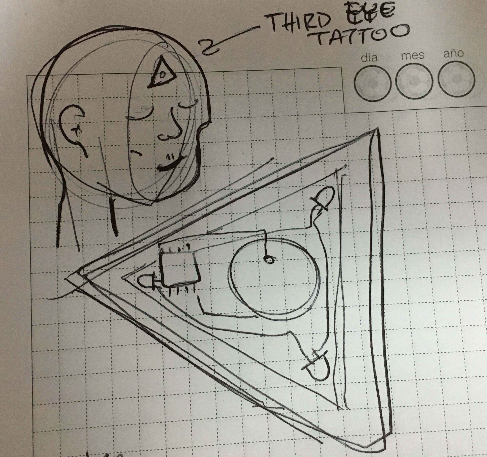
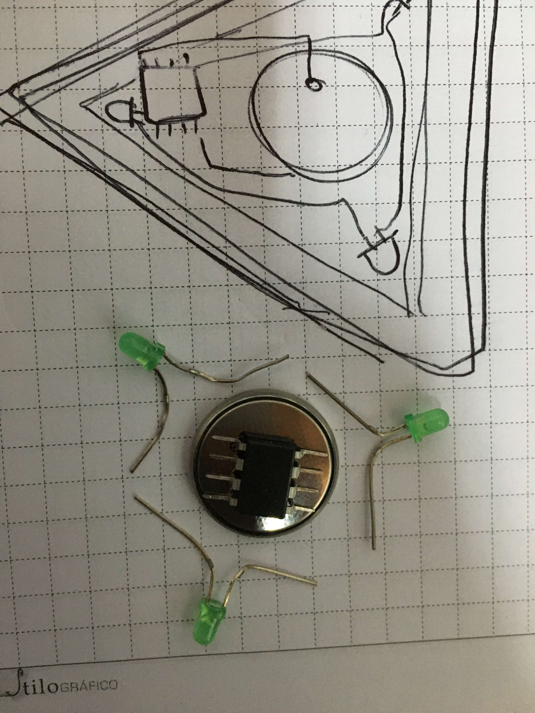
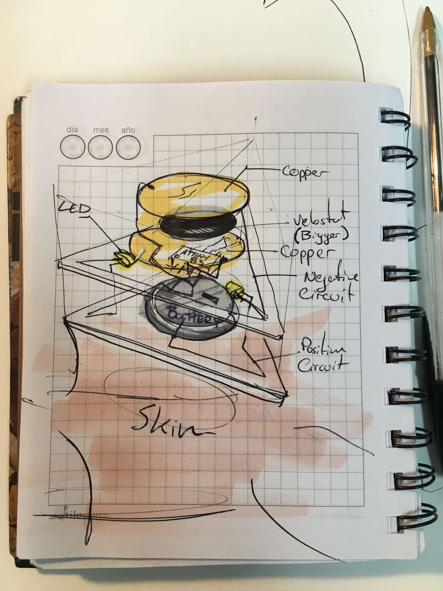

# 13. Skin Electronics

December 15th, 2020

Katia Vega

In the same way that the wearables industry is integrating fashion practices in their development, we envision new partnerships between the biotech/tech companies and skin professionals such as makeup artists…

## Research

 - [Article on Tattoos](https://edgy.app/electronic-tattoos)
 - [Deeper into types of tatoos, by DuoSkin](https://duoskin.media.mit.edu/)
 - [DuoSkin: Rapidly prototyping On-Skin User Interface Paper](https://duoskin.media.mit.edu/duoskin_iswc16.pdf)
 - [Attiny Drawdio bracelet](https://www.kobakant.at/DIY/?p=6577)

##Concept 1 : RF tattoo
Think of a tattoo that opens your front door, while you pull up in the Car. Cool eh?
[image?]
I thought maybe doing an RF transmitter with an attiny 85 might be a cool tattoo, seeing as I am about a month behind on the x-mas party, Ill have to also think about a mask somehow.

In this case I have started to set up the receiver Arduino in order to make sure that I get anything, using the following tutorial.
###Useful links
- [Complete Guide for RF 433MHz Transmitter/Receiver Module With Arduino](https://randomnerdtutorials.com/rf-433mhz-transmitter-receiver-module-with-arduino/)
- [ATtiny85-RF-Remote-Control](https://www.instructables.com/ATtiny85-RF-Remote-Control/)
I start by selecting two Arduinos, and testing them with Blink code. I require the [Radiohead Arduino Library](https://github.com/PaulStoffregen/RadioHead) (for the receiver). I had to [manualy](https://www.arduino.cc/en/guide/libraries#toc4) install the library.

A full day after not getting anything to work I switched to a simpler approach. Ill just leave the documentation if somebody ever needs it.

##Concept 2: Meditation Tattoo
Meditation is an old practice, that can be found in one form or another in multiple cultures. Recently has also seen a resurgence in our culture due to all the health benefits.  

A foreheads tattoo, representing a third eye, that turns on and tells people around you, you are in a meditative state.. or close to it. Also it should look good in photos, and I've picked the habit too.

###The Construction

I was planning to use:  

 -  Attiny 85  

 -  LED, small  

 -  CR2032 battery  

 -  Thin wire  

 -  Transparent layer of Vinyl, by US Chemicals, also has glue innately.  Its sort of like a sticky note.

 -  
### Useful links

- [attiny with capacitive sensor](https://dev.mikamai.com/2014/07/09/attiny85-based-capacitive-sensor-led-switch/)
- [Forum Attiny & cr battery](https://forum.arduino.cc/index.php?topic=216543.0)
- [Turn down all attiny](http://www.nongnu.org/avr-libc/user-manual/group__avr__power.html)  
- [Attiny: Capacitive Sensing](https://www.kobakant.at/DIY/?p=4384) -  This is in How to get what you want, honestly I should have it listed in every page. 

  I might have to use only 1 led.
