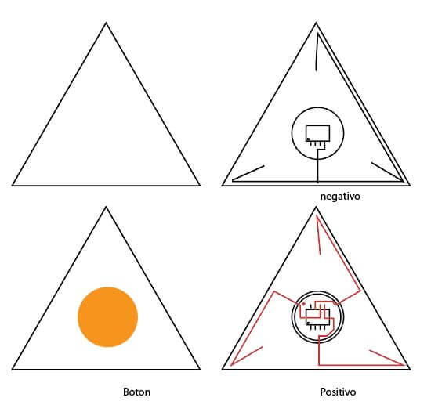
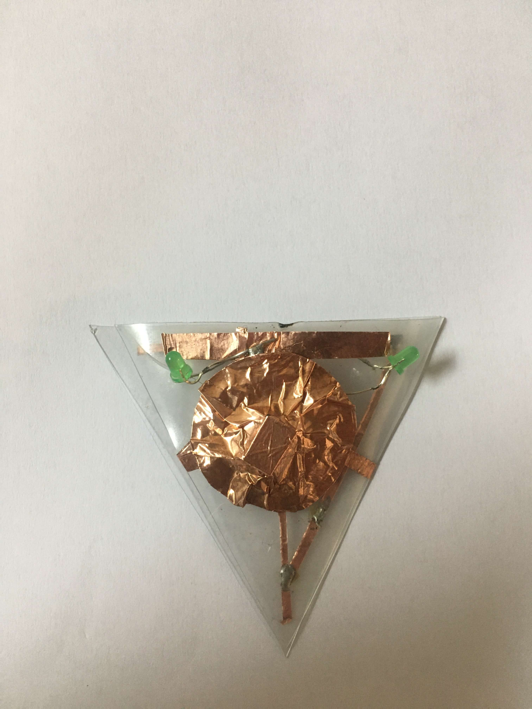
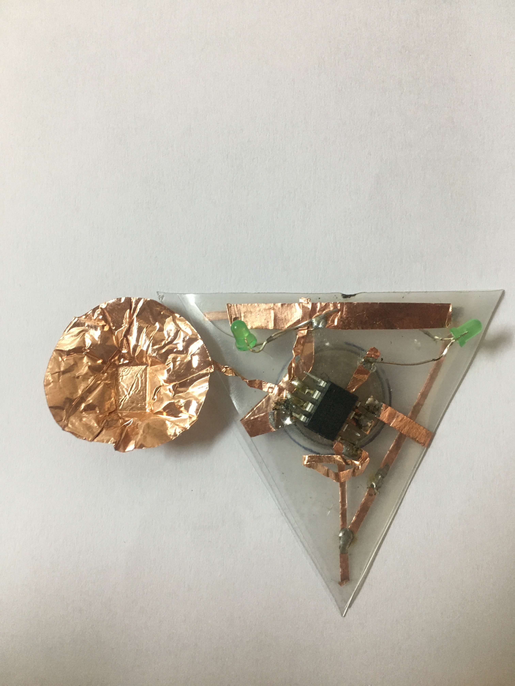
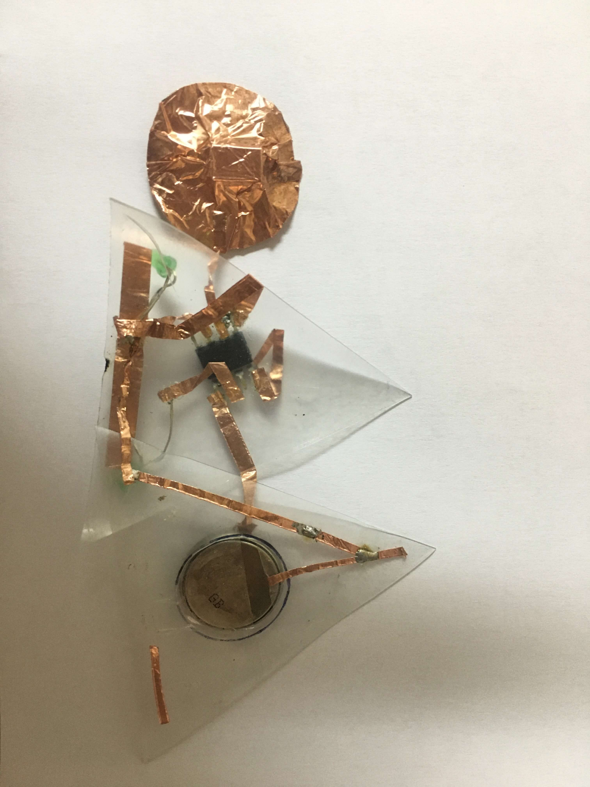
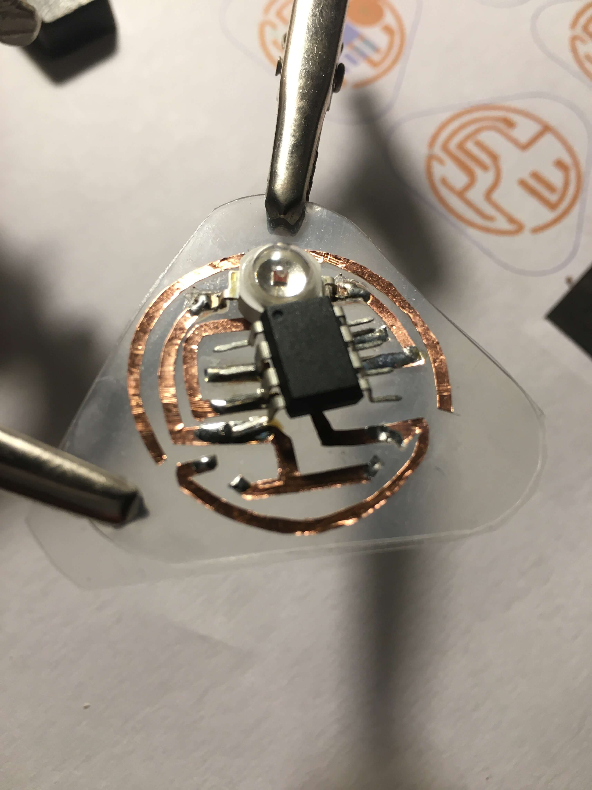
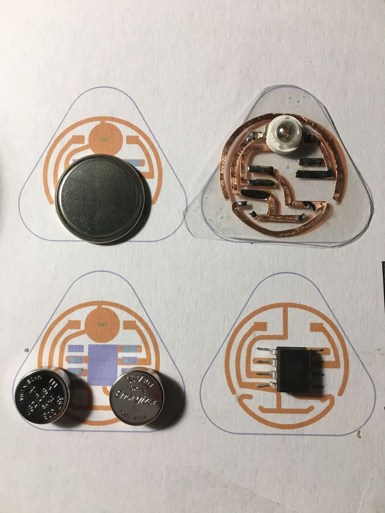

# 13. Skin Electronics

December 15th, 2020

Katia Vega

In the same way that the wearables industry is integrating fashion practices in their development, we envision new partnerships between the biotech/tech companies and skin professionals such as makeup artists…


<iframe src="https://player.vimeo.com/video/524354203" width="640" height="564" frameborder="0" allow="autoplay; fullscreen" allowfullscreen></iframe>

##Concept : Meditation Tattoo
Meditation is an old practice, that can be found in one form or another in multiple cultures. Recently has also seen a resurgence in our culture due to all the health benefits.  


A foreheads tattoo, representing a third eye, that turns on and tells people around you, you are in a meditative state.. or close to it. Also it should look good in photos, and I've picked the habit too.


###The Construction

I was planning to use:  

 -  Attiny 85  

 -  LED, small  

 -  CR2032 battery  

 -  Thin wire  

 -  Transparent layer of Vinyl, by US Chemicals, also has glue innately.  Its sort of like a sticky note.  

   
  
  
  

### Code
   ```   
   //                        attiny85
   //                   reset -+---+- power
   // (on while touching) pb3 -+*  +- pb2 (toggled by touch)
   //       (touch input) pb4 -+   +- pb1 (fading while touching)
   //                  ground -+---+- pb0 (fading always)


   int fadepin1 = 0; // the led that fades on and off
   int fadepin2 = 1; // the led that fades on and off while you're touching the input pin
   int togglepin = 2; // the led that's toggled when you touch the input pin
   int steadypin = 3; // the led that's on while you're touching the input pin

   int calibration = 0;
   int previous;

   int randomval = 0;
   int fadeval = 0, fadestep = 1;
   int togglestate = LOW;

   void setup()
   {
     pinMode(fadepin1, OUTPUT);
     pinMode(fadepin2, OUTPUT);
     pinMode(togglepin, OUTPUT);
     pinMode(steadypin, OUTPUT);

     delay(100);
     for (int i = 0; i < 8; i++) {
       calibration += chargeTime(PB4);
       delay(20);
     }
     calibration = (calibration + 4) / 8;
   }

   void loop()
   {
     int n = chargeTime(PB4);

     if (n > calibration) digitalWrite(steadypin, HIGH);
     else digitalWrite(steadypin, LOW);

     analogWrite(fadepin1, fadeval);
     if (n > calibration) analogWrite(fadepin2, fadeval);
     else analogWrite(fadepin2, 0);
     fadeval = fadeval + fadestep;
     if (fadeval == 255) fadestep = -1;
     if (fadeval == 0) fadestep = 1;

     if (previous <= calibration && n > calibration) {
       if (togglestate == LOW) togglestate = HIGH;
       else togglestate = LOW;

       digitalWrite(togglepin, togglestate);
     }

     previous = n;

     delayMicroseconds(500);
   }

   byte chargeTime(byte pin)
   {
     byte mask = (1 << pin);
     byte i;

     DDRB &= ~mask; // input
     PORTB |= mask; // pull-up on

     for (i = 0; i < 16; i++) {
       if (PINB & mask) break;
     }

     PORTB &= ~mask; // pull-up off
     DDRB |= mask; // discharge

     return i;
   }

   ```
###working Tattoo
   <iframe src="https://player.vimeo.com/video/523993531" width="640" height="564" frameborder="0" allow="autoplay; fullscreen" allowfullscreen></iframe>

### Final work progress
   

  

<iframe src="https://player.vimeo.com/video/524327401" width="640" height="564" frameborder="0" allow="autoplay; fullscreen" allowfullscreen></iframe>  


### Useful links

- [attiny with capacitive sensor](https://dev.mikamai.com/2014/07/09/attiny85-based-capacitive-sensor-led-switch/)
- [Forum Attiny & cr battery](https://forum.arduino.cc/index.php?topic=216543.0)
- [Turn down all attiny](http://www.nongnu.org/avr-libc/user-manual/group__avr__power.html)  
- [Attiny: Capacitive Sensing](https://www.kobakant.at/DIY/?p=4384) -  This is in How to get what you want, honestly I should have it listed in every page.

 - [](http://highlowtech.org/?p=1229)
 - [](https://create.arduino.cc/projecthub/arjun/programming-attiny85-with-arduino-uno-afb829)
 - [LED SMD sides](https://encrypted-tbn0.gstatic.com/images?q=tbn:ANd9GcRbC7EPwi9KnXoyFC1aetX9nqJ9c2lCuVxAjA&usqp=CAU)
