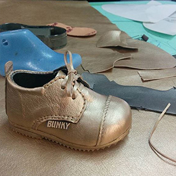
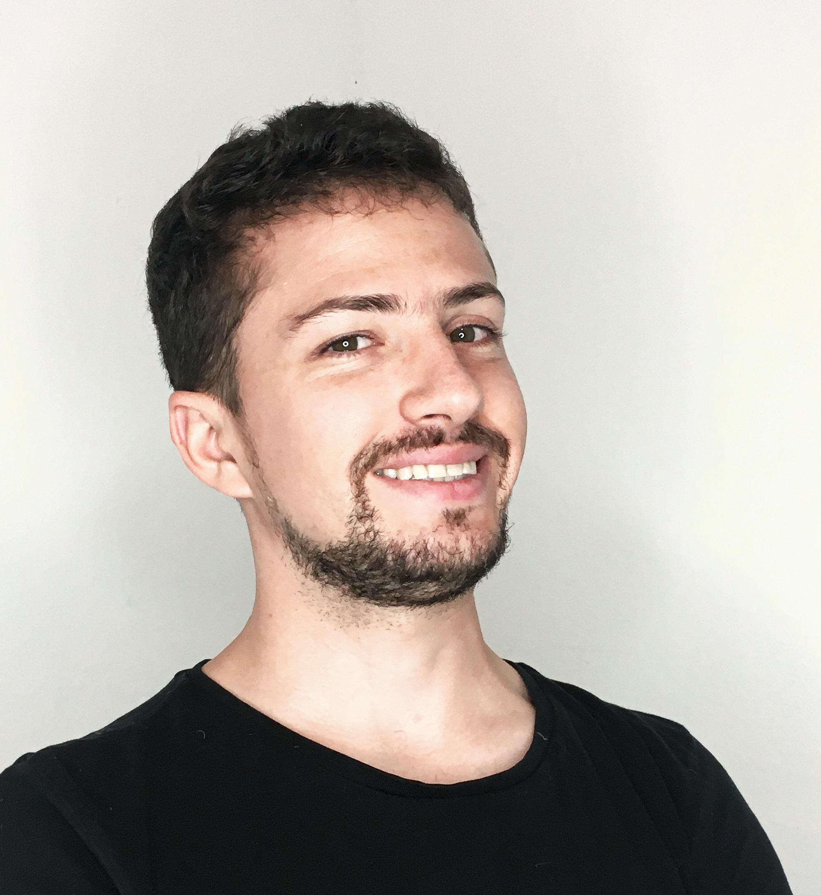

# Fabricademy 2020 by Jorge Correa

## About me

Deep understanding in all things manufacturing attracts and perplexes me. I have a passion for observing and appreciating my surroundings, as such surrounding myself with cool things. Things to use, seat and interact with.

Visit my [Website](https://www.jhc.design) to see my work!

## My background

I'm curious laid back designer, and life long student. Graduated from Carleton University as a bachelor of Industrial design, did a specialization in Footwear design in IED Madrid and constantly strive to learn more and grow.

Developed in Quito's manufacturing industry regarding Construction Furniture and Footwear design, always in-house, always next to the factory so I understand what and how things get done.

## Previous work

I created a [chair that makes you coffee](https://fabacademy.org/2019/labs/zoi/students/jorge-correa/final-projects.html) after you sit on it while I was participant in the Fabacademy 15 class.

### This is me

{: style="height:auto;width:300px"}

I am located in the Andes, beautiful mountains surround me and I´m fond of getting out of the city on the spare time.

This surrounds my city:

You should come visit!
